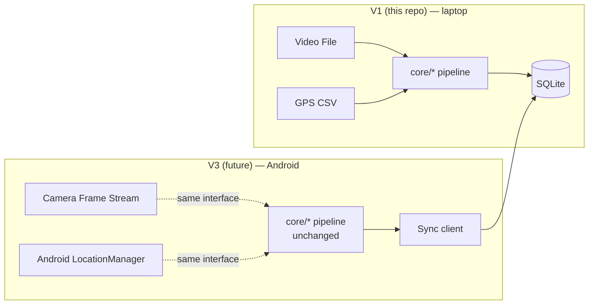

# Android Deployment (Future — Not Implemented in V1)

BARI V1 runs on a laptop against a pre-recorded video file + GPS CSV. This
document explains how the same core pipeline could later run on-device on
Android — **no Android code exists in this repository**; this is a design
plan for Phase 3 of the roadmap (see README "Future Roadmap"), so
architectural choices elsewhere in the project don't have to be redone.

## What changes, what doesn't

`core/gps_sync.py`, `core/events.py`, `core/severity.py`,
`core/location.py`, `core/duplicate.py`, and the `db/` schema are all
already decoupled from "video file" / "CSV file" as a concept — they
operate on `GPSPoint`/timestamp objects and detection boxes, not file
paths. An Android client only has to produce the same shaped inputs:

| V1 input | Android V3 equivalent |
|---|---|
| Video frame read from file via OpenCV | `CameraX` `ImageAnalysis` frame (converted to the same HxWx3 array) |
| GPS row parsed from CSV | `FusedLocationProviderClient` fix, mapped to the same `GPSPoint(timestamp, lat, lon, accuracy, speed, bearing)` shape |
| `ultralytics` PyTorch inference | **ONNX Runtime Mobile** (or TFLite export) running the same `ml/export/export_onnx.py` artifact |
| SQLite via SQLAlchemy on local disk | Room (SQLite) on-device, mirroring `db/models.py`'s schema, syncing to the server's SQLite/Postgres via the `sync_queue` table already in the schema |

## Concrete implementation plan (when undertaken)

1. **On-device inference.** Convert `best.pt` → ONNX (already automated,
   `ml/export/export_onnx.py`) → run through ONNX Runtime Mobile with
   NNAPI/GPU delegate for real-time inference on-device. Benchmark
   on-device latency before committing to a frame rate.
2. **On-device tracking.** Port `core/tracking.py`'s ByteTrack usage to a
   lightweight Kotlin/C++ IOU-based tracker (ByteTrack's algorithm is
   simple enough to reimplement without PyTorch); keep the same
   `MIN_TRACK_FRAMES` persistence-confirmation logic as
   `core/events.py`.
3. **On-device GPS sync.** Re-implement `core/gps_sync.py`'s
   nearest/interpolation logic in Kotlin (it's ~150 lines of pure math, no
   heavy dependencies) so a confirmed detection is timestamped against the
   phone's own `FusedLocationProviderClient` stream the same way.
4. **Evidence + local storage.** Save evidence images to app-private
   storage; mirror `db/models.py`'s `Detection` schema in a local Room
   database.
5. **Sync, not real-time reverse geocoding.** Reverse geocoding (Nominatim)
   and BBMP boundary point-in-polygon lookups are cheap enough to run
   **server-side** once a batch of detections syncs up — avoids draining
   battery/data on-device and avoids exceeding Nominatim's usage policy
   from thousands of individual phones. This is exactly what the
   `sync_queue` table in `db/models.py` is reserved for: an unsynced local
   detection queue, pushed to a central server which runs the same
   `core/location.py` + `core/severity.py` logic V1 already has.
6. **Offline-first.** Detection + tracking + local storage work fully
   offline (V4 roadmap item); only geocoding/boundary resolution and
   dashboard visibility require connectivity, and can be deferred until the
   phone is back online.

## Explicitly not solved yet

- Real-time on-device inference performance has not been benchmarked on any
  Android hardware — only PyTorch-vs-ONNXRuntime-on-CPU is benchmarked in
  V1 (`ml/export/export_onnx.py`).
- No mobile UI, permissions flow, background-service design, or battery
  budget has been designed.
- No server-side sync API exists yet — `sync_queue` is schema-only,
  unused by any endpoint in V1.

This document intentionally stops at "concrete plan," not "shipped code" —
per project scope, Android is a Phase 3+ roadmap item.
