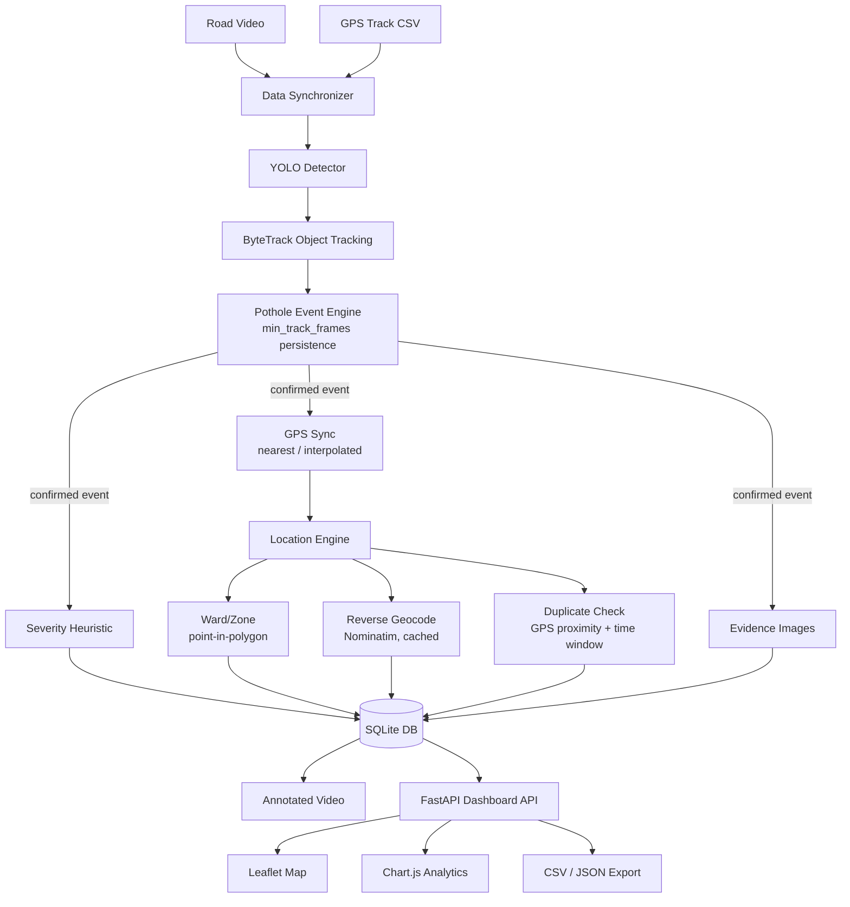
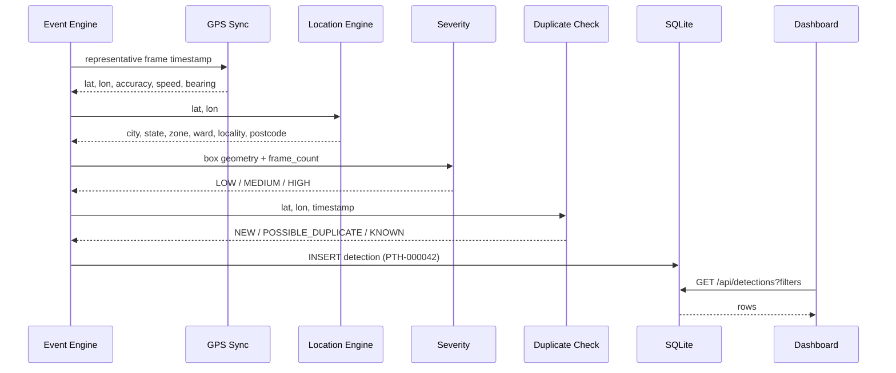

# BARI Architecture

BARI (Bengaluru AI Road Intelligence) V1 is a laptop-run pipeline that turns a
road video + a synchronized GPS log into geolocated, severity-scored pothole
records in a database, visualized on an interactive map/dashboard.

## End-to-end pipeline

## Component responsibilities

| Component | File | Responsibility |
|---|---|---|
| Data Synchronizer | `core/gps_sync.py` | Aligns arbitrary video-frame timestamps to GPS fixes via nearest-neighbor or linear interpolation; tolerates gaps, poor accuracy, clock offset |
| YOLO Detector | `ml/*`, `main.py` | Ultralytics YOLO pothole detector (trained on a real, licensed dataset) |
| Object Tracking | `core/tracking.py` | Wraps Ultralytics' ByteTrack integration so one physical pothole isn't recounted every frame |
| Pothole Event Engine | `core/events.py` | Confirms a track as a real event only after `MIN_TRACK_FRAMES` consecutive detections (Level-1 duplicate suppression) |
| Severity Heuristic | `core/severity.py` | Transparent, tunable LOW/MEDIUM/HIGH estimate from bounding-box geometry + persistence |
| Location Engine | `core/location.py`, `core/boundaries.py`, `core/geocoding.py` | Combines real BBMP ward polygons (point-in-polygon) with cached, rate-limited Nominatim reverse geocoding |
| Duplicate Check | `core/duplicate.py`, `db/crud.py::find_nearby_detections` | Level-2 duplicate detection: has this physical pothole already been recorded (any session), by GPS proximity + recency |
| Evidence | `core/evidence.py` | Saves original / annotated / cropped images under `data/evidence/YYYY/MM/DD/` |
| Database | `db/models.py`, `db/crud.py` | SQLAlchemy models over SQLite: `sessions`, `detections`, `location_cache`, `sync_queue` |
| Dashboard | `dashboard/app.py` + `dashboard/static/` | FastAPI JSON API + Leaflet/Chart.js single-page frontend |

## Why two levels of duplicate detection

1. **Level 1 — same pothole across nearby frames.** A pothole is visible for
   dozens of consecutive frames as the camera approaches it. Without
   tracking, naive per-frame detection would create dozens of DB rows for
   one physical pothole. `core/tracking.py` (ByteTrack) assigns a stable
   `track_id`, and `core/events.py` only confirms *one* event per track,
   once it has persisted for `MIN_TRACK_FRAMES` frames (filters out
   one-frame false positives too).

2. **Level 2 — same pothole seen again later.** A different pass down the
   same road (different session, different day) will detect the same
   physical pothole again with a *different* track_id. `core/duplicate.py`
   classifies a newly confirmed event as `NEW`, `POSSIBLE_DUPLICATE`, or
   `KNOWN` based on GPS distance (`DUPLICATE_DISTANCE_METERS`) and recency
   (`DUPLICATE_TIME_WINDOW_HOURS`) against previously confirmed events —
   ambiguous matches are flagged, not silently merged, so no evidence is
   ever discarded.

## GPS synchronization detail

Video frames and GPS samples are independently-sampled time series. For a
video-frame timestamp `t` (computed as `video_start_time + frame_index/fps`):

- If `t` falls between two GPS samples less than `GPS_MAX_GAP_SECONDS`
  apart, linear-interpolate latitude/longitude (and circularly interpolate
  bearing) between them.
- If the surrounding gap is larger (GPS dropout), fall back to the nearer
  sample and flag the record `NEAREST_STALE`.
- If `t` is before the first or after the last GPS sample, hold the nearest
  edge value and flag `EXTRAPOLATED_EDGE`.
- A configurable `GPS_TIME_OFFSET_SECONDS` corrects for clock drift between
  the video and GPS clocks.
- GPS accuracy above `GPS_MIN_ACCURACY_METERS` is flagged (`is_low_accuracy`)
  but never dropped — a low-confidence fix is still better than no fix.

See `core/gps_sync.py` and `tests/test_gps_sync.py`.

## Data flow: from confirmed event to dashboard

## Future Android deployment path

The pipeline is intentionally split so an Android client can later replace
"video file + GPS CSV" with "live camera frame + live GPS fix" **without**
changing anything downstream of `core/gps_sync.py`. See
`docs/android_deployment.md` for the concrete plan — this is a V2+ roadmap
item, not implemented in V1.
